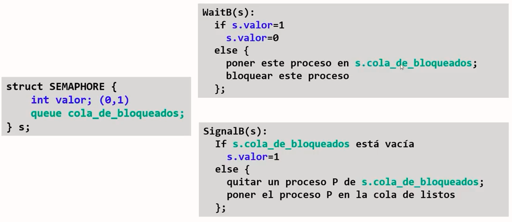
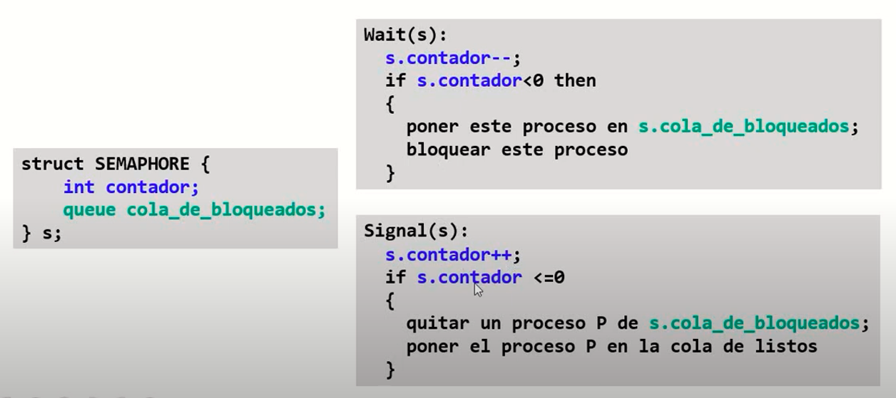

# Resumen de Semaforos binarios y enteros

Los semaforos es una herramienta de sincronizacion que se usa para asignar los recursos a utilizar en un sistema.

Su nombre se debe a que funciona como los semaforos en la vida cotidiana, le permite a los procesos identificar si ya pueden pasar o si tienen que esperar el turno.

## Semaforos Binarios

Estos semaforos tienen la peculiaridad de ser utilizados solo cuando se puede hacer un proceso a la vez. Este semaforo solo permite Valores 1 y 0 lo que significa que solo puede espresar 2 casos: "Esta ocupado" o "Esta Disponible".

## Semaforos Enteros

Estos, a diferencia de los binarios, permite tanto valores positivos como negativos. Generalmente se utiliza cuando se pueden llevar a cabo varios procesos a la vez, en este caso se coloca un limite de procesos a partir de la longitud positiva de la variable de control. 

Esto quiere decir que si la variable es positivo o mayor a 0, esta disponible para la entrada de otro proceso. Si es 0 significa que el proceso debera esperar en la cola. Si es menor que 0 o negativo significa que hay uno o mas procesos esperando en la cola.

# Creador

* Nombre: Joan Corona
* Matricula: 2021-0981